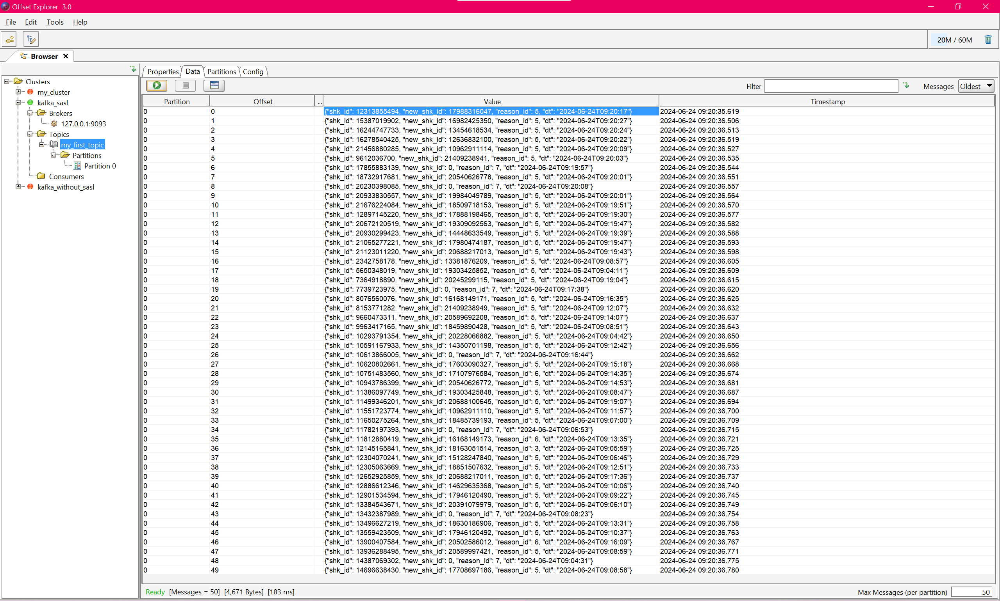
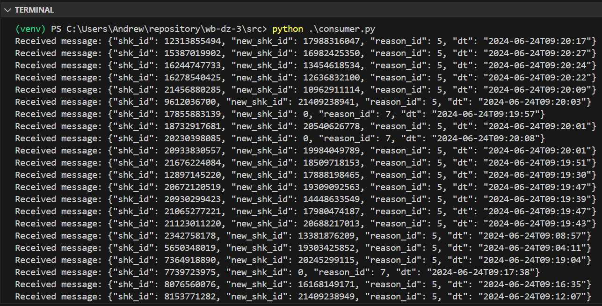

3-е Домашнее задание. Kafka.</h1>

1) Клонируем репо https://github.com/AinKub/WB-Practice-BI-Olap/tree/main/kafka, 

с него берем папку "docker_with_sasl", копируем её к себе в репозиторий, переходим в скопированную папку, 

запускаем docker-compose командой:

<b>docker-compose -f docker-compose-kafka-sasl.yml up -d</b>

Подключаемся с помощью интерфейса offset explorer

2) Создадим новый топик с помощью интерфейса offset explorer

3) Напишем скрипт для заливки данных на основе скрипта с git kafka (./src/producer.py)

4) Запускаем скрипт, смотрим результат

5) Напишем скрипт для чтения данных на основе скрипта с git kafka (./src/consumer.py)

