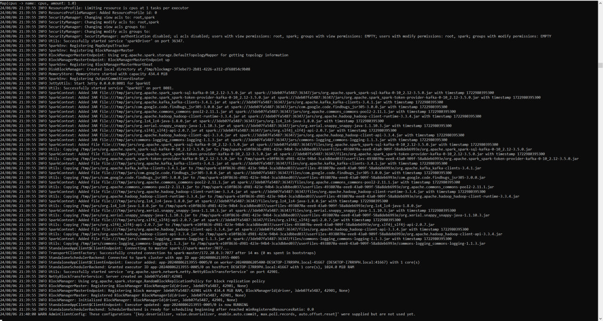
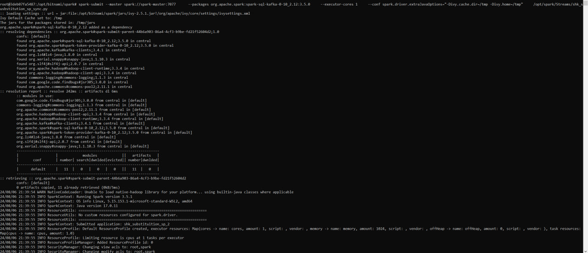

ДЗ (ТЗ):
1. Считать данные из вашей Кафки через спарк. Если нужно, залейте немного данных с пегас.
2. Добавить какую-нибудь колонку. Записать в ваш клик в докере.
3. *Можно через csv импортировать в ваш клик справочник объемов nm_id с пегаса, чтобы оттуда брать объем номенклатуры.
4. Выложить папку с docker-compose файлами для развертывания контейнеров. Должно быть 2 файла: docker-compose.yml, .env.
5. Запушить в свой гит получившийся таск спарк. Не пушить файл с паролями.
6. Выложить в гит скрины с содержимым конечной папки в вашем клике. 
7. Выложить код структуру конечной таблицы в вашем клике.
8. Выложить скрин веб интерфейса вашего спарк.
9. Скрин работы вашего приложения из консоли контейнера

Решение:
1. Запустим контейнера, переходя в соответствующие директории используя команду:
> docker-compose up -d

Подключимся к кафке через интерфейс приложения offset_explorer как в дз кафки
запустим изменёный producer.py, загрузив в топик my-topic 5000 строк из shk_substituted_sp за вчера

Перепишем скрипт для джобы спарка, он лежит в ./Streams/shk_substitution_sp_sync.py

2. Зальем в локальный clickhouse в database default.dict_Warehouse, которым и будем обогощать данные из кафки

Заходим внутрь контейнера spark-master:
> docker exec -u root -it spark-master /bin/bash

Устанавливаем нужные пакеты python в контейнере:
> pip install clickhouse_driver clickhouse_cityhash lz4 pandas

Запускаем задание:
> spark-submit --master spark://spark-master:7077  \
    --packages org.apache.spark:spark-sql-kafka-0-10_2.12:3.5.0 \
    --executor-cores 1 \
    --conf spark.driver.extraJavaOptions="-Divy.cache.dir=/tmp -Divy.home=/tmp" \
    /opt/spark/Streams/shk_susbstitution_sp_sync.py

и смотрим, как со временем растет кол-во строк в default.shk_substituition_sp_2:
> select count() from default.shk_substituition_sp_2;

3. с вавилона был скачан и импортирован в локальный клик default.dict_Warehouse в шаге 2.

4. Файлы лежат в ./docker_clickhouse, ./docker_kafka, ./docker-spark

5. таск спарк лежит в ./Streams/shk_substitution_sp_sync.py, пароли убраны в .gitignore

6. 

7. 

8. 

9. 

