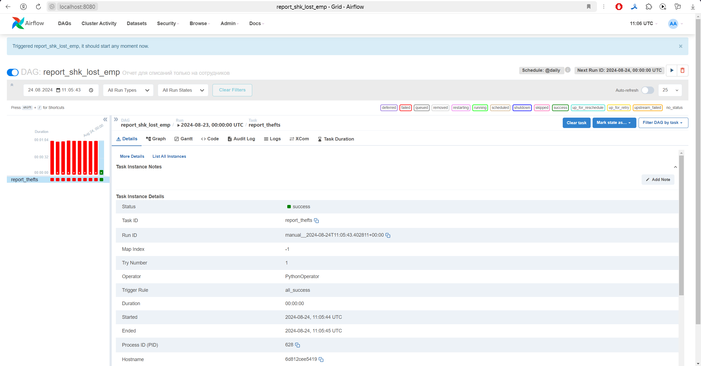
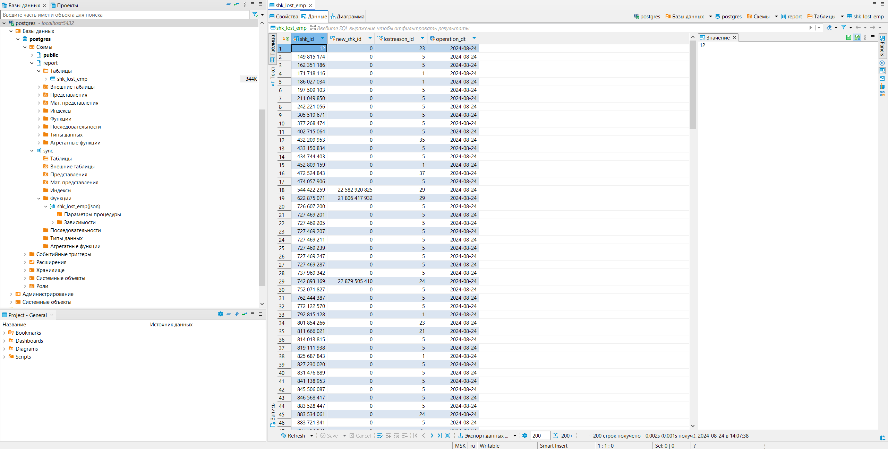

ТЗ для домашнего задания по Airflow:
Установить локально Airflow, ClickHouse, Postgres. Не забыть про то, что им нужно общаться, решайте сами, кому как удобно - через ip хоста или через добавления ClickHouse и Postgres в сеть Airflow.
Сделать даг, берущий данные из вашего локального ClickHouse, как-то их трансформирующий (не обязательно, но желательно), а затем кладущий в витрину на том же клике (сделать схему reports). После этого даг должен взять данные из только что созданной витрины, преобразовать в датафрейм пандас, и заинсертить их в Postgres по методологии, рассказанной Львом на лекции по Postgres (процедура импорта).
В репозиторий гит выложить:

Даг.
Скрин, что даг успешно отработал
Скрин с данными из витрины Postgres

Ход выполнения:
Запустим контейнера из папок docker-airflow, docker-clickhouse, docker-postgresql командой:
> dockerd-compose run -d

Также добавим контейнеры сеть airflow в контейнера clickhouse и postgresql с помощью команд:
> docker network connect docker-airflow_default postgresql
> docker network connect docker-airflow_default clickhouse

Выполним команды из файлов ./docker-clickhouse/click_script.sql и ./docker-postgresql/postgresql_script.sql 
в терминалах поднятых контейнеров clickhouse и postgresql соответственно. Для выолнения команд 
подключаемся через localhost по соответствующему контейнеру порту и заходим под созданным в 
docker-compose.yml файле юзером.

Пишем DAG: <a href="./docker-airflow/dags/dag_script.py">dag_script</a>, скачиваем в контейнеры airflow недостающие библиотеки,
запускаем в интерфейсе airflow, который видим по адресу localhost:8080, написанный dag и проверяем корректность работы.

После успешного запуска дага идем проверять результат в таблицу контейнера postgresql

